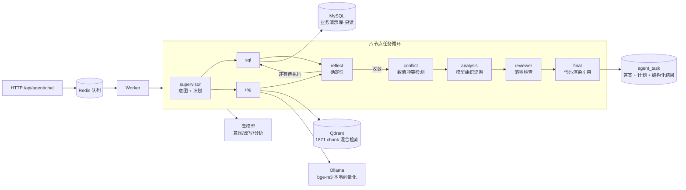

# 企业智能数据分析与决策 Agent

把「自然语言问题」转化为「可追溯的数据结论」的多 Agent 系统：SQL 查询、知识检索、
结果校验与冲突识别在同一个任务循环里协作，全过程可观测、可重放、有界收敛。

设计文档见 [`docs/`](docs/)：

| 文档 | 内容 |
|---|---|
| `企业智能数据分析与决策Agent-需求规格说明书.md` | 功能与非功能需求 |
| `企业智能数据分析与决策Agent-详细设计说明书.md` | 架构、Schema、接口、错误码 |
| `企业智能数据分析与决策Agent-开发流程.md` | 阶段划分、验收命令、门禁 |

---

## 现在能做什么

一句话问题 → 系统自己决定查哪几路（业务库 / 知识库）→ 拿证据 → 交叉核对 → 给出带引用的答案。

```bash
make run       # 一个终端：api + worker
make demo      # 另一个终端：跑固化下来的六条问题
```

六条问题覆盖了四条验收标准，**每条都有可断言的判据**（`configs/demo_questions.yaml`），
而不是打出来让人自己看：

| 用例 | 问题 | 证明什么 |
|---|---|---|
| `demo-sql` | 2025年Q3华东地区的净销售额是多少？ | 简单指标查询**只走 SQL**（FR-PLAN-002 规则 1） |
| `demo-rag` | 华东区域渠道折扣政策对直营渠道的折扣上限？ | 制度问法**只走 RAG**，不去查库 |
| `demo-cross` | …专项分析表里华东的净销售额是多少？与库里一致吗？ | 双源并列 + **检出数值冲突并披露** |
| `demo-expand` | 2026年1月华南地区的净销售额是多少？ | SQL 查不到时**补一路 RAG**（「能根据工具结果继续分析」） |
| `demo-absent` | 跨境出海业务管理办法怎么规定？ | 语料里没有 → **拒答**，不编 |
| `demo-clarify` | 上个季度卖得怎么样？ | 缺时间与指标 → **澄清**，且一次问全 |

> 后两条依赖模型的意图判定与检索排序，**同一个问题两次跑可能不一样**。
> 演示脚本把它们单列成「观察用例」，不混进通过率——那会把
> "模型这次判歪了"说成"系统坏了"。

## 实测数据（这些是跑出来的，不是目标值）

| 门禁 | 命令 | 实测 |
|---|---|---|
| SQL 安全与越权 | `make check` | **28 条 100% 阻断**（含绕开模型、直接喂危险 SQL） |
| 金标 SQL 正确率 | `make eval-sql` | **10/10**（结果集等价） |
| RAG Recall@8 | `make eval-rag` | **19/20 = 95%**（门禁 ≥85%） |
| RAG 定位一致率 | `make eval-rag` | 17/20 = 85% |
| 语料缺陷注入 | `make verify-corpus` | **10/10 类**（其中 2 类只验证了语料侧，见下） |
| 全量检查 | `make check` | 658 单测 + 95 集成 |

---

## 架构总览



**三条边界是硬约束，由 `scripts/check_layering.py` 在 CI 里强制**：
API 进程不得加载 LangGraph 与 Tool（启动变慢、内存翻倍）；
Worker 不得依赖 FastAPI（无法独立扩缩容）；`domain/` 不依赖任何基础设施。
分层表与目录结构见下方「架构」一节。

**`reflect` 是确定性的**（不调模型）：它只看 State 里的事实——还有没有待执行
步骤、哪条路跑了但空、演进预算还剩多少。「SQL 空了就补一路 RAG」这条链路
因此不依赖云模型连通性，而它正是验收标准第③条的核心。

---

## 快速开始（30 分钟内）

### 0. 前置条件

| 组件 | 版本 | 说明 |
|---|---|---|
| Python | 3.12.x | 由 `uv` 自动安装，无需手动准备 |
| uv | 最新 | <https://docs.astral.sh/uv/> |
| Docker + Compose | 最新稳定 | 承载有状态组件 |
| 内存 | ≥ 8GB 可用 | 向量库改判 Qdrant 后实测仅占 300MB（见下方「已知限制」） |

### 1. 初始化

```bash
make bootstrap     # 生成 .env 并安装依赖
```

然后编辑 `.env`，**至少填上模型相关密钥**：

```
MODEL_PROVIDER / MODEL_NAME / MODEL_API_KEY
EMBEDDING_MODEL / EMBEDDING_API_KEY
```

> 密钥只从环境变量加载。`.env` 已在 `.gitignore` 中，任何情况下不得提交或写入 Compose 明文。

### 2. 起有状态组件

```bash
make up            # redis / agent-mysql / business-mysql / minio
```

### 3. 起服务

```bash
make run           # 同时起 api + worker
```

> **不要只跑 `make api`。** API 与 Worker 是两个进程，只起 API 会让任务永远停在
> `QUEUED`，且从 API 日志里几乎看不出原因——这是本项目最常见的自伤方式（开发流程 4.5）。

### 4. 验证

```bash
curl -s localhost:8000/health/live     # {"status":"ok","service":"api"}
curl -s localhost:8000/health/ready    # {"status":"ready","checked":["redis"]}
make check                             # lint + 类型 + 分层约束 + 测试
```

### 5. 调一次接口（Phase 1 起可用）

演示账号 `analyst` / `admin`，口令见 `app/repositories/user_repo.py` 的 `DEMO_ACCOUNTS`
（开发环境占位，`APP_ENV=prod` 时不会写入任何用户）。

```bash
TOKEN=$(curl -s -X POST localhost:8000/api/auth/login -H 'Content-Type: application/json' \
  -d '{"username":"analyst","password":"analyst-dev-pass"}' | python -c 'import sys,json;print(json.load(sys.stdin)["data"]["access_token"])')

curl -s -X POST localhost:8000/api/agent/chat -H "Authorization: Bearer $TOKEN" \
  -H 'Content-Type: application/json' -H 'Idempotency-Key: demo-1' \
  -d '{"message":"华东区第三季度销售额是多少"}'

# 拿上一步返回的 task_id 查状态
curl -s localhost:8000/api/agent/tasks/<task_id> -H "Authorization: Bearer $TOKEN"
```

所有响应（含错误）都是统一外壳 `{code, message, data, trace_id, retryable}`；
`trace_id` 与响应头 `X-Trace-Id` 一致，可直接拿去日志里检索。

> 建完任务后由 Worker 领取并跑完整张图，答案写回 `agent_task`。**只起 API
> 不起 Worker 的话，任务会停在 `QUEUED`**——这是本项目最常见的自伤方式。
>
> 任务详情（`GET /api/agent/tasks/{id}`）除答案外还返回**步骤进度、证据、
> 冲突、审查结论与限制**，它们落在 `agent_task` 的两个 JSON 列里。
> "答案为什么成立"就是从那里查的。

---

## 常用命令

```
make up         启动有状态组件          make check      提交前必跑（lint+类型+分层+测试）
make rag-up     额外启动 Qdrant         make lint       仅静态检查
make down       停止全部                make typecheck  仅类型检查
make redis-cli  进入 Redis 排查         make layering   仅分层约束检查
make api        只起 API 进程           make test       仅单元测试
make worker     只起 Worker 进程        make test-integration  需要真实 Redis 的用例
make run        同时起两个进程          make fmt        格式化并自动修复

make demo       端到端演示六条固化问题   make eval-sql   金标 SQL 评测
make eval-rag   RAG Recall@8 评测        make verify-corpus  语料缺陷注入门禁
make ingest     语料入库并发布            make retrieve   单次混合检索（调试用）
make sql        单次自然语言 → SQL 证据   make tokenize   中文分词逐条核对
```

多实例验收用 `make api PORT=8001`。

排查任务卡住时：

```bash
make redis-cli
> ZCARD q:agent                         # 队列里还有多少没被领走
> HGETALL task:tsk_xxx:record           # 任务状态、worker_id、心跳时间
> XRANGE task:tsk_xxx:events - +        # 事件流（这个任务发布过什么）
> TTL task:tsk_xxx:events               # 事件流保留期（结束后 1 小时）
> ZCARD idx:task:active:usr_xxx         # 该用户占用的并发配额
```

`HGET task:tsk_xxx:record status` 停在 `RUNNING` 而 `heartbeat_at` 很旧，
说明执行它的 Worker 挂了——孤儿回收（每 30 秒一次）会把它置为 `FAILED` + `WORKER_INTERRUPTED`
并释放并发配额。

---

## 架构

### 分层与依赖方向

```
api  →  services  →  agent / domain / tools  →  repositories / infrastructure
```

依赖只能向右。领域 Schema **不依赖** FastAPI，也不依赖具体数据库客户端。

| 层 | 职责 | 禁止 |
|---|---|---|
| `api/` | 鉴权、参数校验、调用 service | 执行 SQL、调用模型、写业务规则、导入 `agent/` 编排实现 |
| `services/` | 编排、事务、事件、队列与限流封装 | 拼接 SQL 字符串、直接实例化 LangGraph |
| `agent/nodes/` | 读写 State、调用 Tool 接口 | 在 Node 内建数据库连接、导入 FastAPI |
| `domain/` | 纯数据模型与校验逻辑 | 依赖 FastAPI、依赖具体数据库客户端 |
| `repositories/` | 数据访问实现 | 包含业务判断 |
| `infrastructure/` | 外部系统客户端与协议实现 | 包含业务规则 |

### 两条进程边界硬约束

1. `app/main.py` 与 `app/api/**` 不得 import `agent.graph`、`agent.nodes.*`、`tools.*`；
2. `app/worker.py` 与 `app/agent/**`、`app/tools/**` 不得 import `fastapi`。

这两条**由 `scripts/check_layering.py` 在 CI 中强制**，而非靠人工 review。破坏后 API 进程
会加载 LangGraph 与全部 Tool，启动变慢、内存翻倍，且 Worker 无法独立扩缩容——影响要到
运行时才暴露。

```bash
make layering
```

### 目录结构

```
app/
├── main.py                     # API 进程入口
├── worker.py                   # Worker 进程入口
├── api/            schemas / errors / middleware / deps / auth / chat / tasks / ...
├── agent/          LangGraph 编排：graph / state / routing / nodes / prompts / schemas
├── tools/          sql（schema/generator/validator/executor）、rag、search
├── domain/         user / conversation / task / evidence / conflict / plan / loop / review（纯模型）
├── services/       auth_service / task_service / task_runner / event_bus / rate_limit / ...
├── repositories/   user_repo / conversation_repo / task_repo（Protocol + 实现）
├── infrastructure/ db / redis / qdrant / storage / model_gateway / observability / logging
├── core/           config / ids / cache / errors / security
└── tests/
```

---

## 配置

全部配置项在 `app/core/config.py` 以 Pydantic Settings 声明，带默认值与上下限。
环境变量清单见 `.env.example`。嵌套配置用双下划线覆盖：

```bash
LOOP__MAX_TOTAL_STEPS=30
```

**循环预算**（`LOOP__*`）直接约束任务循环的收敛性。四类预算
（`MAX_SQL_REPAIRS` / `MAX_REPLANS` / `MAX_REVIEWER_EVIDENCE` / `MAX_EXPANSIONS`）
相互独立、不可借用；任何一项调整后必须重跑循环类评测集。

---

## 已知限制

| 限制 | 影响 | 处理 |
|---|---|---|
| 本机 WSL 内存 7.6GB | Milvus Standalone 需 8GB 起，跑不起来 | **已由 TBC-05 结案解决**：向量库改判 Qdrant（实测 300MB、多进程并发正常），见详细设计 23.1.1 |
| 项目位于 WSL 原生 ext4 | Windows 侧需经 `\\wsl$\` 访问 | 有意为之：`/mnt/c` 走 9p，`uv sync` 与 `pytest` 会慢一个数量级 |
| **Reranker 未做**（TBC-04 后置） | 检索用 RRF 融合后的 Top-8 直接出证据，没有 cross-encoder 重排 | 本机 7.6GB 内存下再跑一个模型会挤占 `bge-m3`；11.7 的「邻近块扩展」随它同批后置 |
| **冲突检测只做 VALUE 一类** | 口径 / 时点 / 范围 / 来源四类没做，各有各的缺前提（见 `app/agent/nodes/conflict.py` 的清单） | Phase 9 |
| **已知误报：表格的合计行与分项行不分** | 实测里一张表的分项行被当成区域合计去比，报出过 92% 的"差异" | 需要表格的合计标记或指标口径的 `grain`；模型能在 `claims` 里自己纠正，检测器这一层还不能 |
| **Reviewer 只做确定性检查** | 14.1 的第二阶段（模型审查）与 `RETRY` / `CLARIFY` 两个状态没做 | Phase 8 完整版 |
| 登录接口未限流 | 可被口令爆破 | Phase 12；已登记在详细设计 19.3 |
| 同义词会导致误拒 | `报备` vs 语料里的 `备案`，余弦 0.74 仍被拒答（金标 rag-06） | 纯词汇规则解决不了，要靠重排器给语义信号 |
| 跨进程 trace 用内存 exporter 断言 | 未接真实追踪后端，线上看不到链路 | 本机无 Jaeger/Grafana；OTLP 开关已就绪，Phase 11 接后端 |

---

## 开发约定

- **分支**：主干开发 + 短生命周期特性分支（`feat/phase-04-sql-validator`）
- **提交**：Conventional Commits（`feat(sql): 增加 AST 表字段白名单校验`）
- **每个 Phase 的节奏**：读文档 → 定 Schema → 写会失败的测试 → 实现 → 本地验证 → 埋点 → 更新配置 → 对照门禁 → 提交
- **完成的定义**：`make check` 全绿、验收命令可重复执行、需求条目逐条核对、Trace 与结构化日志可按 `task_id` 定位、新增配置有默认值与上下限、设计偏离已回写文档、无未标注 TODO

### 日志与脱敏

结构化日志字段固定为
`timestamp、level、service、trace_id、conversation_id、task_id、step_id、node、tool、status、duration_ms、error_code、message`。

**日志、SSE、Trace 默认脱敏**：禁止记录 Token、密码、密钥、完整敏感字段、模型隐藏思维链、SQL 原始行数据。
